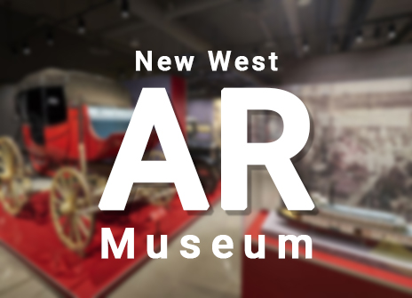
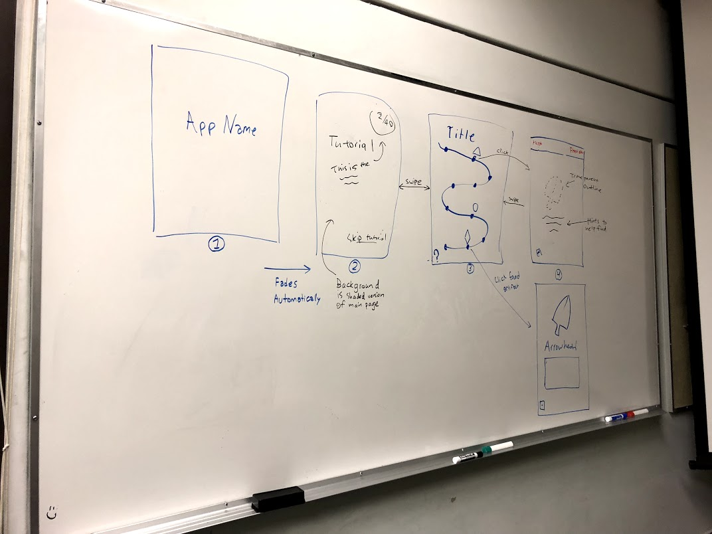

# NWMuseumAR
iOS AR application for the New Westminster museum.

## Design
Our inital design for the application looks like this:

Let's use this as our starting point, although it's obviously subject to change.

## Installation

No installation necasary. We have included all the Pod files so you DO NOT have to install anything.

## Contributing

### AR Image Assets

With iOS 11.3 now out, we now have access to native static image recognition.  Use the following steps to add a new image into the project:

1. Ensure image height and width is at least 480px.
2. Drag image into the AR Resources folder within assets.
3. Click image inside AR Resources folder and go to the attributes inspector.
4. Update the images size as found in the real world.

### Gitflow

1. Fork it (<https://github.com/NewWestMuseumAR/NWMuseumAR/fork>)
2. Create your feature branch (`git checkout -b feature/fooBar`)
3. Commit your changes (`git commit -am 'Add some fooBar'`)
4. Update CHANGELOG.md
5. Push to the branch (`git push origin feature/fooBar`)
6. Create a new Pull Request

## Format
CHANGELOG format is based on [Keep a Changelog](http://keepachangelog.com/en/1.0.0/)

## Happy Coding!
